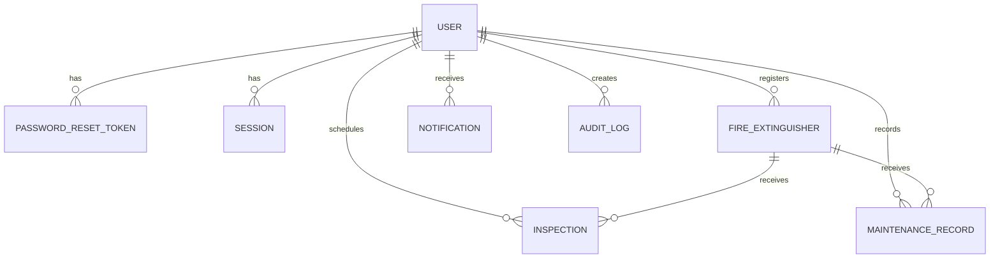

# Entity Relationship Diagram

```mermaid
erDiagram
  USER ||--o{ PASSWORD_RESET_TOKEN : has
  USER ||--o{ SESSION : has
  USER ||--o{ FIRE_EXTINGUISHER : registers
  USER ||--o{ INSPECTION : schedules
  USER ||--o{ MAINTENANCE_RECORD : records
  USER ||--o{ NOTIFICATION : receives
  USER ||--o{ AUDIT_LOG : creates
  FIRE_EXTINGUISHER ||--o{ INSPECTION : receives
  FIRE_EXTINGUISHER ||--o{ MAINTENANCE_RECORD : receives
```

The complete field definitions and constraints are maintained in
`backend/prisma/schema.prisma`.
