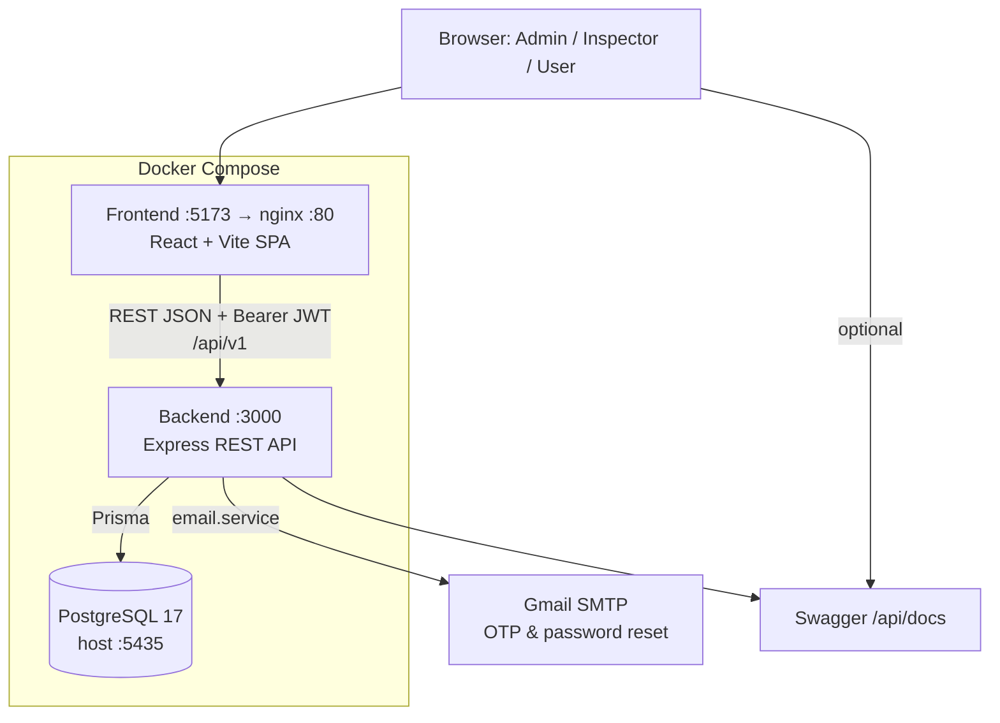
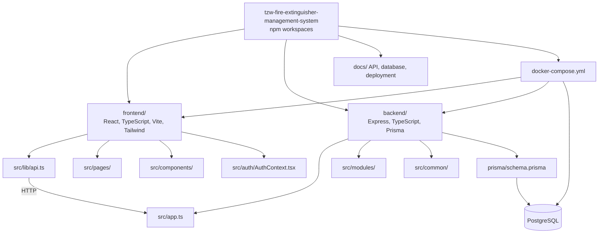
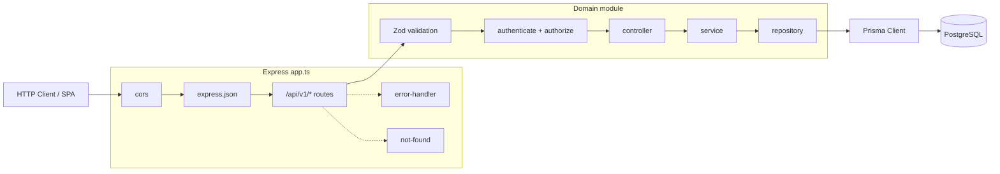
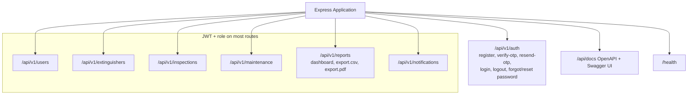
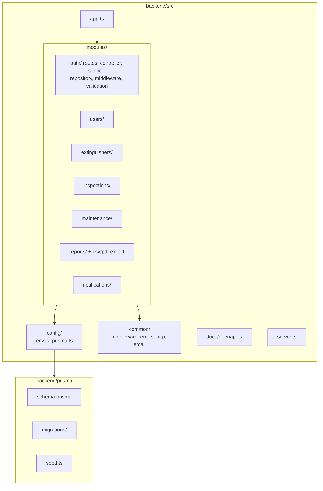
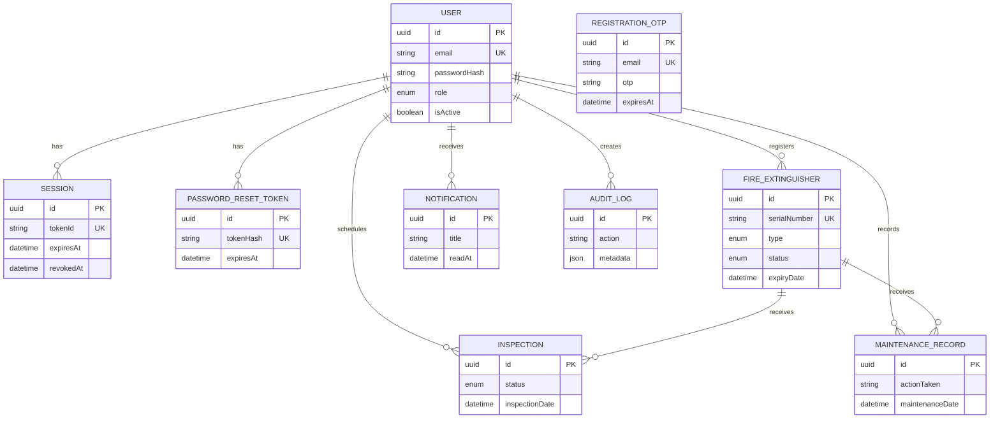
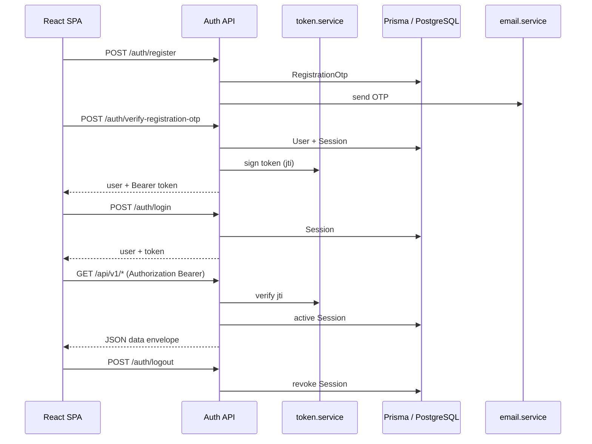
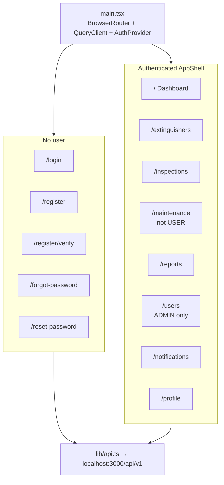
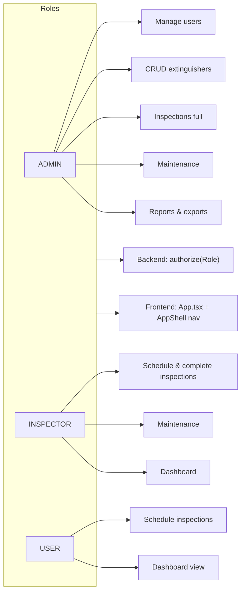
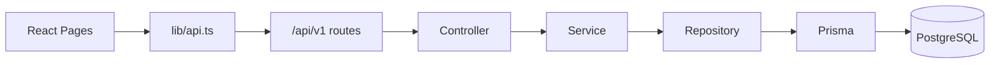

# TZW Fire Extinguisher Management — Architecture Diagrams

Mermaid diagrams for deployment, application layers, API, frontend, auth, and the database.
Field definitions and constraints live in `backend/prisma/schema.prisma`.

---

## 1. Deployment & system context

---

## 2. Monorepo layout

---

## 3. Backend request flow (modular monolith)

---

## 4. API modules & routes

---

## 5. Backend folder structure

---

## 6. Entity relationship diagram (database)

`RegistrationOtp` is a standalone pending-signup table (no FK to `User` until verification completes).

---

## 7. Auth sequence

---

## 8. Frontend routes & structure

---

## 9. Role-based access

---

## 10. End-to-end data flow

